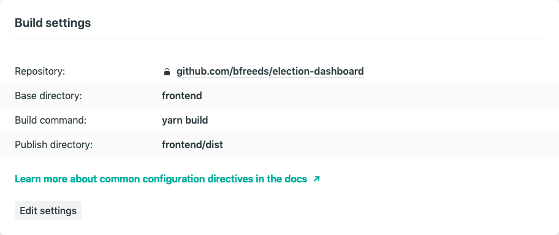
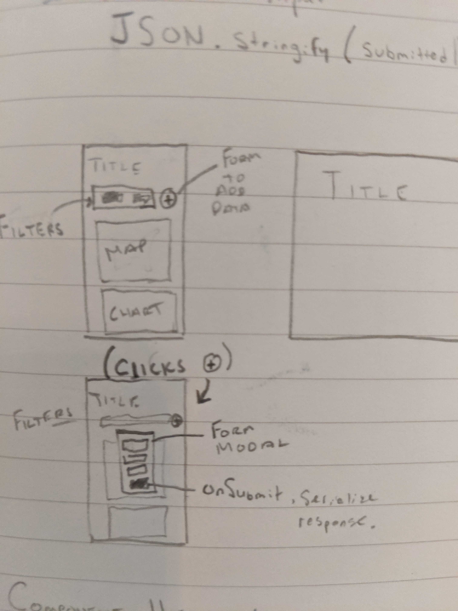
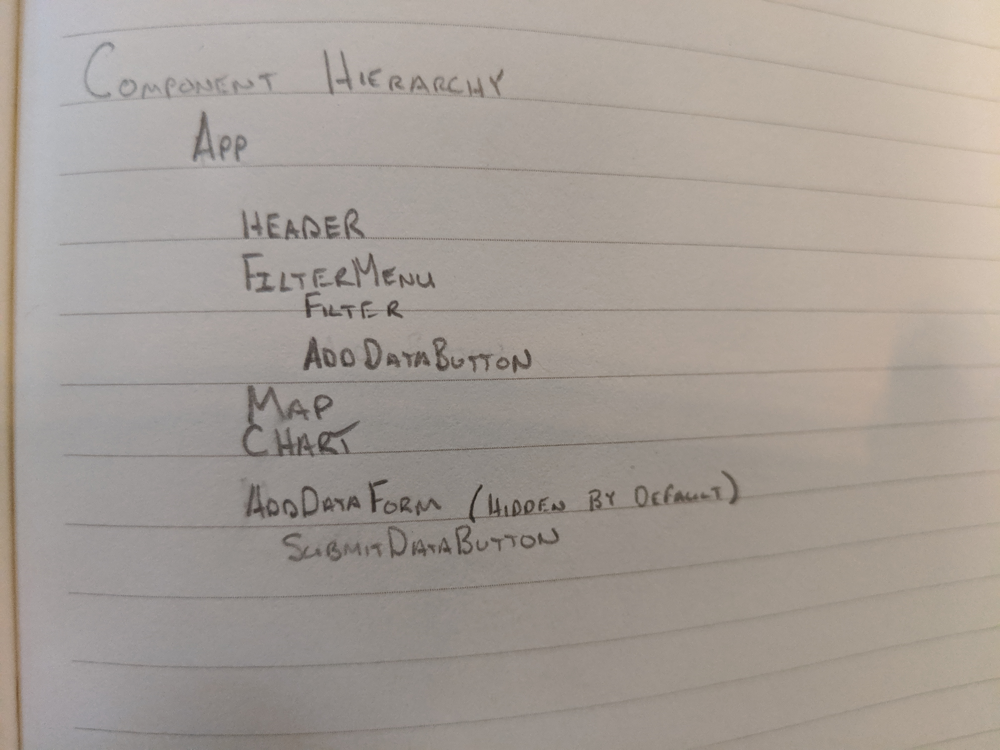
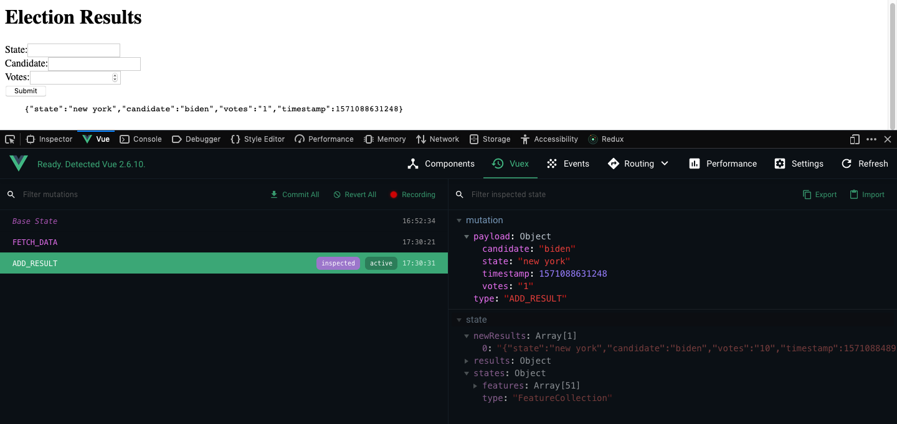

This document is to log thought process, steps, and decisions made while developing/designing.  This is not meant to replace git commits & code comments, but to supplement as a more stream-of-consciousness note taking.

1.  **Understanding the Problem/Requirements**  
  - First step to carefully read the prompt and identify the key requirements.  Feature requirements and goals are to:  
    - Interactive Visualization for Existing Data  
    - Ability for the user to add new records to the election dataset.
2.  **Understand the data**  
  - Want to make sure I understand what form and structure the existing data is in, to get a sense of how much time and energy will be required for ETL.
    - 3 years ('04, '08, '12)
    - Each year has a parties.json, which is a list of all the parties in that year's election.  Could be helpful if you wanted to constrain what a user could enter for "Party" to a defined list set.  However, if there are new parties since 2012, and a user is entering results for a year after 2012 it'd probably be best not to constrain the set of options for the user.
    - Each year has a results dataset, organized as CSV or JSON.
      - CSV:  each row is an election result (unique by year, candidate, and state.  ID column is just `year_state`, so not unique IDs)
      - JSON:  single object, with an object representing state results.  Each state result object has a list (_not an array_) of candidate results.
  - **TODO**:  neither CSV nor JSON has the geographic data for the candidate results.  Will need to join the state results to geographic data (Natural Earth or Census Geographies).  
  - **NOTE**:  Determine how to best visualize the data.  Looking at one state result from 2012, there are 10 candidate results in the data.  Something to start thinking about, as that will influence choices on which visual variables and interactivity to use to encode that information.
3.  **Project Setup**  
  - Get the project deployed as soon as possible so that all future work is iteratively improving the web app & it's not a last-minute thing.  *"Deploy Early, Deploy Often"*
    - will use Netlify since it's easy and quick to setup a custom Continuous Deployment pipeline (with auto previews of pull requests).  Though ultimately this would not work for production, since the app would need a backend to handle the addition of result data from a user, in this case since we're faking the server request on user `submit`, Netlify and static site feels appropriate.
  - Using Vue CLI, which paralells create-react-app, with some common-sense and convenient project setup for a Vue single-page-app.  
  - Also setup pre-commit code formatting and linting to ensure code quality throughout the development process.  Would also be useful for shared codebases, so that there are standards across developers.
  - Create new branch `project-setup` to organize git commits into logical groupings (helpful for communicating thought process and workflow to team).
  - Use @vue-cli to create a `frontend` project.  I look to [TrillCyborg/fullstack](https://github.com/TrillCyborg/fullstack) as an exemplary way to organize code for full stack projects.  Here named just as 'frontend', knowing that because we're faking a trip to the server there won't be a backend/server directory.  I like this because it keeps all the vue code and config files neatly organized into it's own space.
  - Configure Netlify to automatically build and deploy the Vue app on commits (with previews for pull requests).  
  - Submit Pull Request to indicate that project-setup is done.
  - Delete branch on Github and locally, checkout `master`, pull from remote to keep in sync and prep for next feature branch.  
  4.  **Data ETL**  
  - Want to get the data cleaned/processed and loaded into the webapp's store as soon as possible in the development process.  Before doing anything on the frontend, making sure the data is setup how I want it for the visualizations will allow more time to be spend on iteratively designing & developing the data visualizations.  
  - create a feature branch `data-etl`
  - create a makefile to document the steps taken to get and transform natural earth states data.
  - attempt to join states to results with a few tools (mapshaper, postgis).  ran into some obstacles - homebrew seems to have broken connection with postgres and postgis, so I'll need to spend additional time later to fix my postgis installation.  Could use the PostGIS docker image to get around the local system challenges - but that feels overly complicated for now.
  - going to focus on getting the load part of the process complete (get results data into the Vuex state) and will return to the troubleshooting of getting the data in the desired form.  
  - got states data and election results data loaded into the Vue app (with Vuex state).  Spent some time trying to join these two datasets, but hit roadblocks with my system installation of PostGIS and for the sake of time decided to load two files to get to the visualization part of the project  
  - Updated README to reflect current changes to the data-etl code.  Moved Prompt information from the README into Github Issues to clean up the README.
  - Created and merged pull request
  - Deleted branch  
  5.  **Frontend:  Add new data**  
  - Have two tasks remaining:  
    1.  Interactive visualization  
    2.  Add data feature  
  - Going to start by tackling the add data feature, as it's a low hanging fruit and want to just get it out of the way so the rest of the focus can be on the visualization.  
  - Sketched some basic mocks   
  - Wrote up a quick component hierarchy   
  - Create feature branch `#3-add-data` (refers to the github issue #3)
  - Clean out create vue default page/style
  - Add vuetify to speed up development
  - Remove vuetify - added way too much and would rather keep it simple
  - Would use [storybook](https://storybook.js.org/docs/guides/guide-vue/) for developing ui components (like the modal, map, chart, etc.), but for the sake of time am going to just develop it together.
  - Add SubmitButton component, connect to $store.action to update global state
  - Add <pre> element to conditionally render in App.vue based on newResults array.
  - Hook up vuex store to handle actions and update global state. 
  - Create DataForm component to handle 3 inputs, found that having the extra component for SubmitButton was excessive, simplified by removing it and adding the data handling logic in the DataForm component
  - Push branch, merge, auto deploy & close issue #3
  - will return to the styling of that form component after making progress on the data visualization task.
 - 
 6.  **Create Interactive Map**  
 - Going to use D3 so that the map can be us Albers Conformal Conic (US) projection  
 - Goal is to get a basic map working with interactivity - on hover update Vuex State with `currentState`.  Then `currentState` can be used across other visuals & components in the dashboard to filter the results data.  
 - Create `map` branch & `Map.vue` component
 - Install d3.js
 - Look into techniques for combining Vue.js and D3.js
   - [Shirley Wu Example Repo](https://github.com/sxywu/vue-d3-example/tree/master/src)
   - [Andre de Vries Tutorial](https://levelup.gitconnected.com/d3-js-and-vue-js-7a6a721eb79f)
- Got D3 and Vue to render a static map, ran out of time to implement the second chart with interactivity.  Steps I would take:
  - Add event listener to state paths on hover (change class to change style and give user feedback/affordance about interactivity)
  - Add event listener to state paths on click (hook up event handler to vuex store actions & mutations so that there is a currentState value)
  - Create second chart (bar chart) for each state from results data
  - Listen in this Chart component for currentState (dynamically selected from Map event listener & vuex action)
  - Update Chart component by filtering for currentState, use a computed property to reactively update the chart
  - Style the app... hide the data entry behind a button ("Add Data"), connect dynamically to css class that hides or shows the data entry form.
  - design for mobile / responsive / resize the Map and Chart with window event listeners.